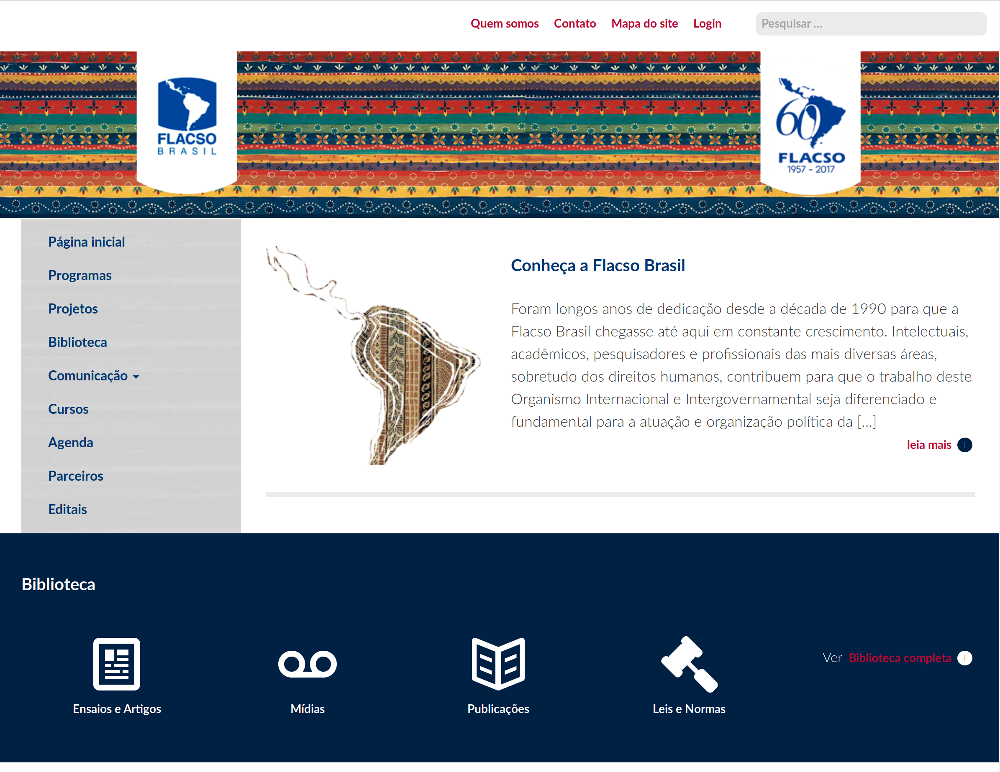
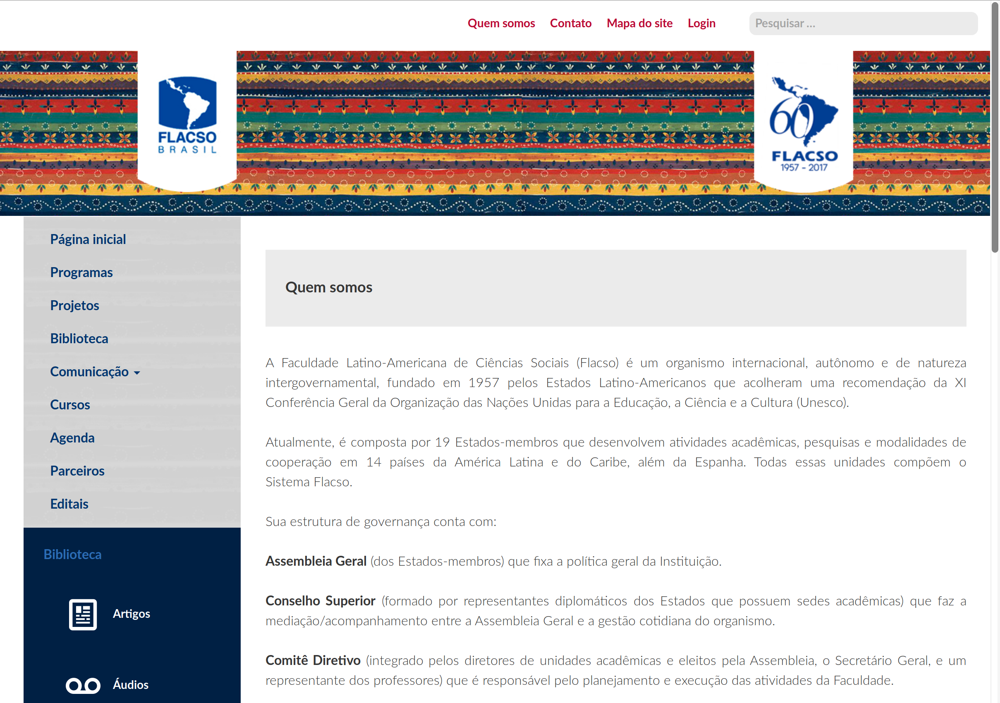

# Flacso

Site intitucional da Universidade FLACSO

A Faculdade Latino-Americana de Ciências Sociais (Flacso) é um organismo internacional, autônomo e de natureza intergovernamental, fundado em 1957 pelos Estados Latino-Americanos que acolheram uma recomendação da XI Conferência Geral da Organização das Nações Unidas para a Educação, a Ciência e a Cultura (Unesco).

# capturas

## Organização das **issues**
As *issues* podem ser acompanhadas através do [Waffle.io](https://waffle.io). As colunas usadas para separar os estágios são as [mesmas recomendadas pelos desenvolvedores da ferramenta](https://waffle.io/blog/2014/06/15/how-waffle-uses-waffle-to-build-waffle/), sendo elas:

**Ideas**: Qualquer issue nova aparecerá nessa coluna. O importante é refiná-la sempre para encontrar as melhores issues para se trabalhar. Quando encontradas, os cartões são enviados para a coluna **Backlog**. 

**Backlog**: Qualquer *issue* vista como importante para um futuro não muito distante se encontra no **Backlog**. As prioridades são definidas a partir da ordem dos cartões, sendo os de cima os mais importantes. 

**Ready**: Aqui moram as *issues* que estão já prontas para serem trabalhadas nos próximos momentos. 

**In Progress**: Todas as *issues* que já estão sendo trabalhadas. É importante que nessa coluna cada cartão / *issue* já tenha sido atribuída a um dono. 

**Needs Review**: *Issues* que precisam de uma avaliação adicional ficam nessa coluna. É também um bom lugar para *pull requests*. 

**Done**: Onde moram as *issues* já fechadas. Para os *pull requests*, isso significa que o código já foi fundido. 
